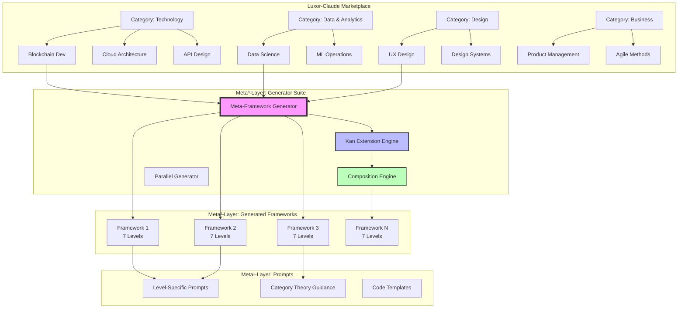

# Architecture Diagrams: Meta-Framework Generator Suite

**Visual Reference for Luxor-Claude Marketplace Integration**

---

## 1. Overall System Architecture



---

## 2. Framework Generation Pipeline

```
┌─────────────────────────────────────────────────────────────────┐
│                         INPUT                                    │
│  Topic: "Blockchain Development"                                 │
│  Category: Technology                                            │
│  Depth: 7 levels                                                 │
│  Iterations: 3 Kan extensions                                    │
└───────────────────────┬─────────────────────────────────────────┘
                        │
                        ▼
┌─────────────────────────────────────────────────────────────────┐
│  PHASE 1: DOMAIN ANALYSIS (Comonadic Extraction)                │
│  ┌──────────────────────────────────────────────────────────┐   │
│  │ • Extract primitives (objects)                           │   │
│  │ • Identify operations (morphisms)                        │   │
│  │ • Discover composition patterns                          │   │
│  │ • Map to categorical structures                          │   │
│  └──────────────────────────────────────────────────────────┘   │
│                                                                   │
│  Output: DomainAnalysis {                                        │
│    primitives: [Transaction, Block, Chain, Validator]           │
│    operations: [validate, append, consensus, execute]           │
│    patterns: [Chain composition, Merkle trees, PoW]             │
│  }                                                                │
└───────────────────────┬─────────────────────────────────────────┘
                        │
                        ▼
┌─────────────────────────────────────────────────────────────────┐
│  PHASE 2: LEVEL ARCHITECTURE                                     │
│  ┌──────────────────────────────────────────────────────────┐   │
│  │ L1: Novice      → Transaction Primitives                │   │
│  │ L2: Competent   → Block Composition                      │   │
│  │ L3: Proficient  → Consensus Mechanisms                   │   │
│  │ L4: Advanced    → Smart Contracts                        │   │
│  │ L5: Expert      → Layer-2 Scaling                        │   │
│  │ L6: Master      → Cross-Chain Protocols                  │   │
│  │ L7: Visionary   → Novel Architectures                    │   │
│  └──────────────────────────────────────────────────────────┘   │
│                                                                   │
│  Verify: L₁ ⊂ L₂ ⊂ L₃ ⊂ L₄ ⊂ L₅ ⊂ L₆ ⊂ L₇                      │
└───────────────────────┬─────────────────────────────────────────┘
                        │
                        ▼
┌─────────────────────────────────────────────────────────────────┐
│  PHASE 3: CATEGORICAL FRAMEWORK                                  │
│  ┌──────────────────────────────────────────────────────────┐   │
│  │ Define Category:                                         │   │
│  │   Objects: {Transaction, Block, Chain, ...}             │   │
│  │   Morphisms: {validate, append, consensus, ...}         │   │
│  │   Composition: (f ∘ g)(x) = f(g(x))                     │   │
│  │   Identity: id_A(a) = a                                  │   │
│  │                                                          │   │
│  │ Create Functors: F_i: Level_i → Level_{i+1}            │   │
│  │                                                          │   │
│  │ Natural Transformations: η: F ⟹ G                       │   │
│  └──────────────────────────────────────────────────────────┘   │
└───────────────────────┬─────────────────────────────────────────┘
                        │
                        ▼
┌─────────────────────────────────────────────────────────────────┐
│  PHASE 4: CODE GENERATION                                        │
│  ┌──────────────────────────────────────────────────────────┐   │
│  │ For each level:                                          │   │
│  │   • Generate working code examples                       │   │
│  │   • Create templates                                     │   │
│  │   • Build test cases                                     │   │
│  │   • Document patterns                                    │   │
│  └──────────────────────────────────────────────────────────┘   │
│                                                                   │
│  Example: L4 Smart Contract →                                    │
│    ├── Solidity ERC-20 implementation                            │
│    ├── Vyper version                                             │
│    ├── Test suite                                                │
│    └── Deployment scripts                                        │
└───────────────────────┬─────────────────────────────────────────┘
                        │
                        ▼
┌─────────────────────────────────────────────────────────────────┐
│  PHASE 5: KAN EXTENSION ITERATIONS                              │
│                                                                   │
│  Iteration 1: Conservative Refinement                            │
│  ┌──────────────────────────────────────────────────────────┐   │
│  │ Right Kan: Ran_F(G) - approximation from above          │   │
│  │ • Fill gaps in coverage                                  │   │
│  │ • Add missing examples                                   │   │
│  │ • Improve explanations                                   │   │
│  └──────────────────────────────────────────────────────────┘   │
│                        │                                          │
│                        ▼                                          │
│  Iteration 2: Balanced Enhancement                               │
│  ┌──────────────────────────────────────────────────────────┐   │
│  │ Both Kan extensions                                      │   │
│  │ • Cross-cutting concerns                                 │   │
│  │ • Integration patterns                                   │   │
│  │ • Performance optimization                               │   │
│  └──────────────────────────────────────────────────────────┘   │
│                        │                                          │
│                        ▼                                          │
│  Iteration 3: Aggressive Innovation                              │
│  ┌──────────────────────────────────────────────────────────┐   │
│  │ Left Kan: Lan_F(G) - approximation from below           │   │
│  │ • Novel categorical structures                           │   │
│  │ • Advanced constructions                                 │   │
│  │ • Breakthrough insights                                  │   │
│  └──────────────────────────────────────────────────────────┘   │
└───────────────────────┬─────────────────────────────────────────┘
                        │
                        ▼
┌─────────────────────────────────────────────────────────────────┐
│                      OUTPUT                                       │
│                                                                   │
│  Complete Framework:                                              │
│  ├── Metadata (topic, version, iterations)                       │
│  ├── 7 Sophistication Levels                                     │
│  ├── Categorical Foundations                                     │
│  ├── Working Code Examples (50+ examples)                        │
│  ├── Integration Patterns                                        │
│  ├── Self-Evolution Capability                                   │
│  └── Composition Interface                                       │
│                                                                   │
│  Ready for Marketplace Deployment ✓                              │
└─────────────────────────────────────────────────────────────────┘
```

---

## 3. Parallel Generation System

```
Marketplace Request: Generate frameworks for entire category
                              │
                              ▼
┌─────────────────────────────────────────────────────────────────┐
│                   TOPIC ANALYSIS                                 │
│                                                                   │
│  Input: [Topic₁, Topic₂, Topic₃, ..., Topicₙ]                   │
│                                                                   │
│  Analyze dependencies:                                           │
│    Topic₁ → Topic₃  (dependency)                                 │
│    Topic₂ independent                                            │
│    Topic₃ independent of Topic₂                                  │
│                                                                   │
│  Build dependency graph:                                         │
│                                                                   │
│         Topic₁                                                   │
│        ↙      ↘                                                  │
│    Topic₃   Topic₂                                               │
│       │                                                          │
│    Topic₄                                                        │
└───────────────────────┬─────────────────────────────────────────┘
                        │
                        ▼
┌─────────────────────────────────────────────────────────────────┐
│              PARALLEL GENERATION (Topological)                   │
│                                                                   │
│  Level 0: Independent topics                                     │
│  ┌───────────────┐     ┌───────────────┐                        │
│  │ Generate      │     │ Generate      │                        │
│  │ Topic₁        │     │ Topic₂        │                        │
│  │               │     │               │                        │
│  │ [Worker 1]    │     │ [Worker 2]    │                        │
│  └───────────────┘     └───────────────┘                        │
│         │                      │                                 │
│         └──────────┬───────────┘                                 │
│                    ▼                                              │
│  Level 1: Depends on Level 0                                     │
│  ┌───────────────────────────────────┐                          │
│  │ Generate Topic₃                   │                          │
│  │ (uses Topic₁ as context)          │                          │
│  │                                    │                          │
│  │ [Worker 3]                         │                          │
│  └───────────────────────────────────┘                          │
│                    │                                              │
│                    ▼                                              │
│  Level 2: Depends on Level 1                                     │
│  ┌───────────────────────────────────┐                          │
│  │ Generate Topic₄                   │                          │
│  │ (uses Topic₃ as context)          │                          │
│  │                                    │                          │
│  │ [Worker 4]                         │                          │
│  └───────────────────────────────────┘                          │
│                                                                   │
│  Execution time: O(depth) instead of O(n) ✓                     │
└───────────────────────┬─────────────────────────────────────────┘
                        │
                        ▼
┌─────────────────────────────────────────────────────────────────┐
│                  COMPOSITION & CACHING                           │
│                                                                   │
│  All frameworks generated                                         │
│  │                                                                │
│  ├─ Cache individual frameworks                                  │
│  │                                                                │
│  ├─ Compute cross-framework compositions:                        │
│  │    Framework₁ × Framework₂  (product)                         │
│  │    Framework₁ + Framework₃  (coproduct)                       │
│  │    Framework₂ ×_S Framework₃ (pullback)                       │
│  │                                                                │
│  └─ Store in framework registry                                  │
│                                                                   │
│  All frameworks ready for marketplace ✓                          │
└─────────────────────────────────────────────────────────────────┘
```

---

## 4. Framework Composition Architecture

```
┌────────────────────────────────────────────────────────────────┐
│                   FRAMEWORK COMPOSITION                         │
│                                                                  │
│  Input: Multiple frameworks                                     │
│  Output: Composed framework                                     │
└────────────────────────────────────────────────────────────────┘

Four Composition Modes:

1. PRODUCT (×)
   ═══════════════════════════════════════════════════════
   Framework₁ × Framework₂

                F₁ × F₂
               ↗       ↖
              π₁        π₂
             ↙           ↘
           F₁             F₂

   Use case: Combine two domains simultaneously
   Example: (Blockchain × Data Science) for crypto analytics

   Implementation:
   ┌──────────────────────────────────────────────┐
   │ Level i of (F₁ × F₂):                       │
   │   Objects: L₁[i].objects × L₂[i].objects    │
   │   Morphisms: L₁[i].morphisms × L₂[i].morphisms│
   │   Examples: Pair examples from both         │
   └──────────────────────────────────────────────┘


2. COPRODUCT (+)
   ═══════════════════════════════════════════════════════
   Framework₁ + Framework₂

            F₁             F₂
              ↘           ↙
               ι₁      ι₂
                ↘     ↙
                F₁ + F₂

   Use case: Either/or branching
   Example: (Mobile + Web) for cross-platform development

   Implementation:
   ┌──────────────────────────────────────────────┐
   │ Level i of (F₁ + F₂):                       │
   │   Objects: L₁[i].objects ∪ L₂[i].objects    │
   │   Morphisms: L₁[i].morphisms ∪ L₂[i].morphisms│
   │   Routing: Choose at runtime               │
   └──────────────────────────────────────────────┘


3. PULLBACK (×_S)
   ═══════════════════════════════════════════════════════
   F₁ ×_S F₂  (over shared foundation S)

        F₁ ×_S F₂ ──→ F₂
            │          │
            ↓          ↓
            F₁ ──────→ S

   Use case: Frameworks with common foundation
   Example: (Frontend × Backend) over "Web Architecture"

   Implementation:
   ┌──────────────────────────────────────────────┐
   │ Level i of Pullback:                        │
   │   Objects: {(o₁, o₂) | f₁(o₁) = f₂(o₂) in S}│
   │   Only pairs that agree in shared context   │
   └──────────────────────────────────────────────┘


4. KAN COMPOSITION
   ═══════════════════════════════════════════════════════
   Lan_F₁(F₂) or Ran_F₁(F₂)

   Use case: Frameworks don't directly compose
   Example: Lift (Classical ML) to (Deep Learning)

   Left Kan (Generalization):
   ┌──────────────────────────────────────────────┐
   │ Lan_F₁(F₂) = colim_{F₁(x)→y} F₂(x)         │
   │                                              │
   │ Best approximation from below                │
   │ Generalizes F₂ along F₁                     │
   └──────────────────────────────────────────────┘

   Right Kan (Specialization):
   ┌──────────────────────────────────────────────┐
   │ Ran_F₁(F₂) = lim_{y→F₁(x)} F₂(x)           │
   │                                              │
   │ Best approximation from above                │
   │ Specializes F₂ along F₁                     │
   └──────────────────────────────────────────────┘
```

---

## 5. Self-Evolution Cycle

```
┌─────────────────────────────────────────────────────────────────┐
│                   SELF-EVOLUTION LOOP                            │
└─────────────────────────────────────────────────────────────────┘

     ┌──────────────────────────────────────┐
     │  Framework v1.0                      │
     │  (Initial generation)                │
     └───────────┬──────────────────────────┘
                 │
                 │ Deploy to marketplace
                 ▼
     ┌──────────────────────────────────────┐
     │  USAGE PHASE                         │
     │  • Users query framework             │
     │  • Track success/failure             │
     │  • Collect feedback ratings          │
     │  • Monitor usage patterns            │
     └───────────┬──────────────────────────┘
                 │
                 │ Data collected
                 ▼
     ┌──────────────────────────────────────┐
     │  ANALYSIS PHASE                      │
     │                                       │
     │  Compute metrics:                    │
     │  • Level quality scores              │
     │  • Success rates per level           │
     │  • Common failure patterns           │
     │  • User satisfaction per level       │
     │                                       │
     │  Example output:                     │
     │    L1: 0.95 ✓                        │
     │    L2: 0.88 ✓                        │
     │    L3: 0.65 ⚠  (needs improvement)   │
     │    L4: 0.92 ✓                        │
     │    ...                                │
     └───────────┬──────────────────────────┘
                 │
                 │ Identify weak areas
                 ▼
     ┌──────────────────────────────────────┐
     │  DECISION PHASE                      │
     │                                       │
     │  Should evolve?                      │
     │  ├─ Any level < 0.7? → YES           │
     │  ├─ Overall score < 0.8? → YES       │
     │  └─ Manual trigger → YES             │
     │                                       │
     │  If NO: Continue monitoring          │
     │  If YES: Proceed to evolution        │
     └───────────┬──────────────────────────┘
                 │
                 │ Evolution needed
                 ▼
     ┌──────────────────────────────────────┐
     │  KAN ITERATION PHASE                 │
     │                                       │
     │  For each weak level:                │
     │  1. Extract feedback issues          │
     │  2. Generate improvements            │
     │  3. Apply Kan extension:             │
     │     • Conservative → Right Kan       │
     │     • Aggressive → Left Kan          │
     │     • Balanced → Both                │
     │  4. Verify coherence                 │
     │  5. Test improvements                │
     └───────────┬──────────────────────────┘
                 │
                 │ Generate v1.1
                 ▼
     ┌──────────────────────────────────────┐
     │  VALIDATION PHASE                    │
     │                                       │
     │  Automated checks:                   │
     │  • Categorical coherence ✓           │
     │  • Code compiles ✓                   │
     │  • Tests pass ✓                      │
     │  • No regressions ✓                  │
     │                                       │
     │  If all pass → Deploy v1.1           │
     │  If fail → Retry or rollback         │
     └───────────┬──────────────────────────┘
                 │
                 │ Deploy improved version
                 ▼
     ┌──────────────────────────────────────┐
     │  Framework v1.1                      │
     │  (Evolved version)                   │
     └───────────┬──────────────────────────┘
                 │
                 │ Continue cycle
                 └─────────► USAGE PHASE

Evolution Strategy:
══════════════════════════════════════════════════
Conservative:  Small refinements, high safety
Balanced:      Moderate improvements, tested changes
Aggressive:    Novel structures, breakthrough attempts

Iteration History:
══════════════════════════════════════════════════
v1.0 → v1.1 → v1.2 → v2.0 (major update)
  ↓      ↓      ↓      ↓
Can rollback to any previous version
```

---

## 6. Category-Theoretic Structure Diagram

```
                    MARKETPLACE CATEGORY STRUCTURE

┌──────────────────────────────────────────────────────────────────┐
│                        2-CATEGORY: Market                         │
├──────────────────────────────────────────────────────────────────┤
│                                                                    │
│  0-cells (Objects):    Topics {T₁, T₂, T₃, ...}                  │
│                                                                    │
│  1-cells (Morphisms):  Generators {Gen : Topic → Framework}      │
│                                                                    │
│  2-cells (2-Morphisms): Kan Iterations {κ : Gen ⟹ Gen'}         │
│                                                                    │
└──────────────────────────────────────────────────────────────────┘


COMPOSITION DIAGRAM:
═══════════════════════════════════════════════════════════════

Horizontal Composition (Topics):
────────────────────────────────

  Topic₁ ──Gen₁──→ Framework₁
     │                  │
     │                  │ Compose
     │                  │
     ↓                  ↓
  Topic₂ ──Gen₂──→ Framework₂
     │                  │
     │                  │ Result
     ↓                  ↓
  Topic₁×Topic₂ ──→ Framework₁×Framework₂


Vertical Composition (Iterations):
───────────────────────────────────

  Topic ════Gen_v0═══→ Framework_v0
    ║                      ║
    ║ κ₁ (Iteration 1)     ║
    ⇓                      ⇓
  Topic ════Gen_v1═══→ Framework_v1
    ║                      ║
    ║ κ₂ (Iteration 2)     ║
    ⇓                      ⇓
  Topic ════Gen_v2═══→ Framework_v2


Kan Extension Diagram:
───────────────────────

Left Kan (Generalization):

      C ─────F────→ D
      │             ↗
    G │           ∃Lan_F(G)
      ↓         ↗
      E ──────┘


Right Kan (Specialization):

      C ─────F────→ D
      │             ↘
    G │             ∃Ran_F(G)
      ↓               ↘
      E ──────────────→


Comonad Structure (Evolution):
────────────────────────────────

  W(Framework) = Framework with full history

  ε: W → Id     (extract current)
  ┌────────────────────────────┐
  │ W(F) = F :< [F₀, F₁, F₂]  │
  │                            │
  │ extract(W(F)) = F          │
  └────────────────────────────┘

  δ: W → W²     (explore variations)
  ┌────────────────────────────────────┐
  │ duplicate(F :< history) =          │
  │   F :< [F :< history,              │
  │        F₁ :< history₁,             │
  │        F₂ :< history₂]             │
  └────────────────────────────────────┘
```

---

## 7. Data Flow Diagram

```
┌──────────────────────────────────────────────────────────────────┐
│                         DATA FLOW                                 │
└──────────────────────────────────────────────────────────────────┘

1. Topic Registration
══════════════════════════════════════════════════════════════
   Marketplace              Generator Suite            Database
        │                          │                       │
        │  POST /register-topic    │                       │
        ├─────────────────────────→│                       │
        │                          │                       │
        │                          │  Store config         │
        │                          ├──────────────────────→│
        │                          │                       │
        │                          │  Ack                  │
        │                          │←──────────────────────┤
        │  Topic registered        │                       │
        │←─────────────────────────┤                       │


2. Framework Generation (On-Demand)
══════════════════════════════════════════════════════════════
   User                   Marketplace          Generator        Cache
    │                          │                    │             │
    │  Request framework       │                    │             │
    │ (topic_id)               │                    │             │
    ├─────────────────────────→│                    │             │
    │                          │                    │             │
    │                          │  Check cache       │             │
    │                          ├────────────────────┼────────────→│
    │                          │                    │             │
    │                          │  Cache miss        │             │
    │                          │←───────────────────┼─────────────┤
    │                          │                    │             │
    │                          │  Generate          │             │
    │                          ├───────────────────→│             │
    │                          │                    │             │
    │                          │  [Generation       │             │
    │                          │   pipeline runs]   │             │
    │                          │                    │             │
    │                          │  Framework         │             │
    │                          │←───────────────────┤             │
    │                          │                    │             │
    │                          │  Store in cache    │             │
    │                          ├────────────────────┼────────────→│
    │                          │                    │             │
    │  Framework               │                    │             │
    │←─────────────────────────┤                    │             │


3. Parallel Batch Generation
══════════════════════════════════════════════════════════════
   Marketplace            Generator                Workers
        │                     │                       │
        │  Generate category  │                       │
        │  [T₁, T₂, T₃, T₄]  │                       │
        ├────────────────────→│                       │
        │                     │                       │
        │                     │  Analyze dependencies │
        │                     │  Graph: T₁→T₃         │
        │                     │         T₂ indep      │
        │                     │                       │
        │                     │  Dispatch level 0     │
        │                     ├──────────────────────→│
        │                     │  Gen(T₁) [Worker 1]   │
        │                     │  Gen(T₂) [Worker 2]   │
        │                     │                       │
        │                     │  Wait for completion  │
        │                     │                       │
        │                     │  Results: F₁, F₂      │
        │                     │←──────────────────────┤
        │                     │                       │
        │                     │  Dispatch level 1     │
        │                     ├──────────────────────→│
        │                     │  Gen(T₃) [Worker 3]   │
        │                     │  (uses F₁ context)    │
        │                     │                       │
        │                     │  Result: F₃           │
        │                     │←──────────────────────┤
        │                     │                       │
        │  All frameworks     │                       │
        │  [F₁, F₂, F₃]       │                       │
        │←────────────────────┤                       │


4. Self-Evolution Trigger
══════════════════════════════════════════════════════════════
   Usage Tracker        Analyzer          Evolution Engine
        │                   │                     │
        │  Feedback data    │                     │
        ├──────────────────→│                     │
        │                   │                     │
        │                   │  Compute scores     │
        │                   │  L3: 0.65 ⚠        │
        │                   │                     │
        │                   │  Trigger evolution  │
        │                   ├────────────────────→│
        │                   │                     │
        │                   │  [Kan iteration]    │
        │                   │                     │
        │                   │  Improved framework │
        │                   │←────────────────────┤
        │                   │                     │
        │                   │  Deploy v1.1        │
        │                   │                     │
```

---

## 8. Component Interaction Map

```
┌──────────────────────────────────────────────────────────────────┐
│                    COMPONENT INTERACTIONS                         │
└──────────────────────────────────────────────────────────────────┘

┌─────────────────┐
│  Marketplace    │
│  API Layer      │◄────────────┐
└────────┬────────┘             │
         │                      │
         │ HTTP                 │ Webhooks
         ▼                      │
┌─────────────────────────────────────┐
│  MarketplaceIntegration             │
│  • register_topic()                 │
│  • get_framework()                  │
│  • compose_frameworks()             │
│  • evolve_framework()               │
└─────┬──────────┬────────┬───────────┘
      │          │        │
      ▼          ▼        ▼
┌──────────┐  ┌─────────────────┐  ┌──────────────┐
│Framework │  │FrameworkComposer│  │Evolution     │
│Registry  │  │                 │  │Trigger       │
└──────────┘  └─────────────────┘  └──────────────┘
      │              │                     │
      │              │                     │
      ▼              ▼                     ▼
┌─────────────────────────────────────────────────┐
│         MetaFrameworkGenerator                   │
│  • generate()                                    │
│  • analyze_domain()                              │
│  • design_levels()                               │
│  • apply_category_theory()                       │
│  • generate_code_examples()                      │
│  • kan_iterate()                                 │
└───┬──────────┬──────────┬──────────┬────────────┘
    │          │          │          │
    ▼          ▼          ▼          ▼
┌─────────┐ ┌─────────┐ ┌──────────┐ ┌─────────────┐
│Meta2    │ │Category │ │Kan       │ │Template     │
│Agent    │ │Master   │ │Extension │ │Engine       │
│         │ │Skill    │ │Engine    │ │             │
└─────────┘ └─────────┘ └──────────┘ └─────────────┘
    │                        │              │
    │                        │              │
    ▼                        ▼              ▼
┌──────────────────────────────────────────────────┐
│              Supporting Services                  │
│  • LLM Provider (GPT-4, Claude, etc.)            │
│  • Code Execution Sandbox                        │
│  • Test Runner                                   │
│  • Version Control                               │
└──────────────────────────────────────────────────┘
```

---

## Summary

These diagrams provide a complete visual reference for:

1. **Overall Architecture**: How all components fit together
2. **Generation Pipeline**: Step-by-step framework creation
3. **Parallel System**: Concurrent generation with dependencies
4. **Composition**: How frameworks combine
5. **Evolution**: Self-improvement cycle
6. **Category Theory**: Mathematical structures
7. **Data Flow**: Information movement through system
8. **Components**: Interaction between modules

Use these diagrams alongside the main specification document for implementation and communication with stakeholders.

---

**Version**: 1.0
**Last Updated**: 2025-11-19
**Format**: Mermaid + ASCII Art
