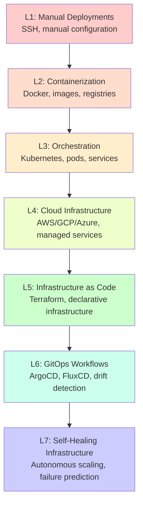

# DevOps & Infrastructure as Code Meta-Framework

## Executive Summary

A comprehensive categorical framework for DevOps and Infrastructure as Code practices, progressing from manual deployments to self-healing infrastructure systems. This framework integrates with Luxor Marketplace components and provides practical patterns for modern infrastructure management.

## Framework Architecture

### 7-Level Progression Model



## Level 1: Manual Deployments

### Core Concepts
- **SSH Access**: Direct server connections for deployment
- **Manual Configuration**: Hand-edited configuration files
- **Script-Based Deployment**: Shell scripts for basic automation

### Implementation Pattern

```bash
#!/bin/bash
# Basic deployment script

# Connect to server
ssh user@server << 'EOF'
  # Stop application
  sudo systemctl stop myapp

  # Deploy new code
  cd /var/www/myapp
  git pull origin main

  # Install dependencies
  npm install --production

  # Start application
  sudo systemctl start myapp
EOF

# Verify deployment
curl -f http://server/health || exit 1
```

### Categorical Structure
- **Objects**: Servers, applications, configurations
- **Morphisms**: SSH connections, file transfers, manual updates
- **Identity**: No-op deployments

## Level 2: Containerization

### Core Concepts
- **Docker Images**: Immutable application packaging
- **Container Registries**: Centralized image storage
- **Multi-stage Builds**: Optimized image creation

### Docker Best Practices

```dockerfile
# Multi-stage Dockerfile
FROM node:18-alpine AS builder
WORKDIR /app
COPY package*.json ./
RUN npm ci --only=production

FROM node:18-alpine
WORKDIR /app
RUN apk add --no-cache tini
COPY --from=builder /app/node_modules ./node_modules
COPY . .
USER node
ENTRYPOINT ["/sbin/tini", "--"]
CMD ["node", "server.js"]
```

### Docker Compose Pattern

```yaml
version: '3.8'

services:
  app:
    build:
      context: .
      dockerfile: Dockerfile
      cache_from:
        - ${REGISTRY}/myapp:cache
    image: ${REGISTRY}/myapp:${VERSION}
    environment:
      - NODE_ENV=production
    healthcheck:
      test: ["CMD", "curl", "-f", "http://localhost:3000/health"]
      interval: 30s
      timeout: 10s
      retries: 3
    deploy:
      replicas: 3
      restart_policy:
        condition: on-failure
        delay: 5s
        max_attempts: 3
```

### Categorical Structure
- **Functor F₂**: Manual → Container (containerization transformation)
- **Natural Transformation**: Configuration migration patterns

## Level 3: Orchestration

### Core Concepts
- **Kubernetes Resources**: Pods, Services, Deployments
- **Service Discovery**: DNS-based service resolution
- **Load Balancing**: Traffic distribution patterns

### Kubernetes Deployment Pattern

```yaml
apiVersion: apps/v1
kind: Deployment
metadata:
  name: myapp
  labels:
    app: myapp
    version: v1
spec:
  replicas: 3
  selector:
    matchLabels:
      app: myapp
  template:
    metadata:
      labels:
        app: myapp
        version: v1
    spec:
      containers:
      - name: app
        image: myregistry/myapp:v1.0.0
        ports:
        - containerPort: 8080
        env:
        - name: DB_HOST
          valueFrom:
            secretKeyRef:
              name: db-secret
              key: host
        resources:
          requests:
            memory: "128Mi"
            cpu: "100m"
          limits:
            memory: "256Mi"
            cpu: "500m"
        livenessProbe:
          httpGet:
            path: /health
            port: 8080
          initialDelaySeconds: 30
          periodSeconds: 10
        readinessProbe:
          httpGet:
            path: /ready
            port: 8080
          initialDelaySeconds: 5
          periodSeconds: 5
```

### Service Mesh Pattern

```yaml
apiVersion: v1
kind: Service
metadata:
  name: myapp-service
spec:
  selector:
    app: myapp
  ports:
  - protocol: TCP
    port: 80
    targetPort: 8080
  type: LoadBalancer
---
apiVersion: networking.k8s.io/v1
kind: Ingress
metadata:
  name: myapp-ingress
  annotations:
    nginx.ingress.kubernetes.io/rewrite-target: /
spec:
  rules:
  - host: myapp.example.com
    http:
      paths:
      - path: /
        pathType: Prefix
        backend:
          service:
            name: myapp-service
            port:
              number: 80
```

### Categorical Structure
- **Functor F₃**: Container → Orchestrated (orchestration transformation)
- **Monoidal Category**: Service composition with tensor product

## Level 4: Cloud Infrastructure

### Core Concepts
- **Managed Services**: RDS, ElastiCache, Lambda
- **Auto-scaling**: Dynamic resource allocation
- **Multi-region Deployment**: Geographic distribution

### AWS Infrastructure Pattern

```yaml
# CloudFormation template
AWSTemplateFormatVersion: '2010-09-09'
Description: 'Cloud Infrastructure Stack'

Parameters:
  Environment:
    Type: String
    Default: production
    AllowedValues: [development, staging, production]

Resources:
  VPC:
    Type: AWS::EC2::VPC
    Properties:
      CidrBlock: 10.0.0.0/16
      EnableDnsHostnames: true
      EnableDnsSupport: true
      Tags:
        - Key: Name
          Value: !Sub ${AWS::StackName}-vpc

  ApplicationLoadBalancer:
    Type: AWS::ElasticLoadBalancingV2::LoadBalancer
    Properties:
      Type: application
      Scheme: internet-facing
      Subnets: !Ref PublicSubnets
      SecurityGroups:
        - !Ref ALBSecurityGroup

  ECSCluster:
    Type: AWS::ECS::Cluster
    Properties:
      ClusterName: !Sub ${AWS::StackName}-cluster
      CapacityProviders:
        - FARGATE
        - FARGATE_SPOT
      DefaultCapacityProviderStrategy:
        - CapacityProvider: FARGATE_SPOT
          Weight: 2
        - CapacityProvider: FARGATE
          Weight: 1
```

### Categorical Structure
- **Functor F₄**: Orchestrated → Cloud (cloud transformation)
- **Adjoint Functors**: Local ⊣ Cloud deployment patterns

## Level 5: Infrastructure as Code

### Core Concepts
- **Declarative Infrastructure**: Terraform configurations
- **State Management**: Remote state backends
- **Module Design**: Reusable infrastructure components

### Terraform Module Pattern

```hcl
# main.tf
terraform {
  required_version = ">= 1.0"

  required_providers {
    aws = {
      source  = "hashicorp/aws"
      version = "~> 5.0"
    }
  }

  backend "s3" {
    bucket = "terraform-state-bucket"
    key    = "infrastructure/terraform.tfstate"
    region = "us-east-1"
    dynamodb_table = "terraform-state-lock"
    encrypt = true
  }
}

# VPC Module
module "vpc" {
  source = "./modules/vpc"

  cidr_block = var.vpc_cidr
  availability_zones = var.availability_zones

  public_subnet_cidrs  = var.public_subnet_cidrs
  private_subnet_cidrs = var.private_subnet_cidrs

  enable_nat_gateway = true
  single_nat_gateway = var.environment != "production"

  tags = local.common_tags
}

# EKS Cluster
module "eks" {
  source = "./modules/eks"

  cluster_name    = "${var.project}-${var.environment}"
  cluster_version = var.kubernetes_version

  vpc_id     = module.vpc.vpc_id
  subnet_ids = module.vpc.private_subnet_ids

  node_groups = {
    main = {
      desired_capacity = var.node_group_desired_capacity
      max_capacity     = var.node_group_max_capacity
      min_capacity     = var.node_group_min_capacity

      instance_types = ["t3.medium"]

      k8s_labels = {
        Environment = var.environment
        NodeGroup   = "main"
      }
    }
  }

  tags = local.common_tags
}

# RDS Database
module "rds" {
  source = "./modules/rds"

  identifier = "${var.project}-${var.environment}-db"

  engine               = "postgres"
  engine_version       = "15.3"
  instance_class       = var.db_instance_class
  allocated_storage    = var.db_allocated_storage

  db_name  = var.db_name
  username = var.db_username
  password = random_password.db_password.result

  vpc_security_group_ids = [module.security.rds_security_group_id]
  db_subnet_group_name   = module.vpc.database_subnet_group_name

  backup_retention_period = var.environment == "production" ? 30 : 7
  backup_window          = "03:00-04:00"
  maintenance_window     = "sun:04:00-sun:05:00"

  enabled_cloudwatch_logs_exports = ["postgresql"]

  tags = local.common_tags
}
```

### State Management Pattern

```hcl
# backend.tf
terraform {
  backend "s3" {
    bucket         = "terraform-state-${var.account_id}"
    key            = "${var.environment}/${var.region}/terraform.tfstate"
    region         = var.region
    encrypt        = true
    dynamodb_table = "terraform-state-lock"

    role_arn = "arn:aws:iam::${var.account_id}:role/TerraformStateRole"
  }
}

# State locking with DynamoDB
resource "aws_dynamodb_table" "terraform_state_lock" {
  name           = "terraform-state-lock"
  billing_mode   = "PAY_PER_REQUEST"
  hash_key       = "LockID"

  attribute {
    name = "LockID"
    type = "S"
  }

  server_side_encryption {
    enabled = true
  }

  point_in_time_recovery {
    enabled = true
  }

  tags = {
    Name        = "Terraform State Lock Table"
    Environment = var.environment
  }
}
```

### Categorical Structure
- **Functor F₅**: Cloud → IaC (codification transformation)
- **Monoidal Structure**: Module composition with ⊗ operator

## Level 6: GitOps Workflows

### Core Concepts
- **Declarative Deployments**: Git as single source of truth
- **Continuous Reconciliation**: ArgoCD/FluxCD synchronization
- **Drift Detection**: Automatic divergence identification

### ArgoCD Application Pattern

```yaml
apiVersion: argoproj.io/v1alpha1
kind: Application
metadata:
  name: myapp
  namespace: argocd
  finalizers:
    - resources-finalizer.argocd.argoproj.io
spec:
  project: default
  source:
    repoURL: https://github.com/myorg/myapp-config
    targetRevision: HEAD
    path: overlays/production
    kustomize:
      images:
      - myregistry/myapp:v1.0.0
  destination:
    server: https://kubernetes.default.svc
    namespace: production
  syncPolicy:
    automated:
      prune: true
      selfHeal: true
      allowEmpty: false
    syncOptions:
    - CreateNamespace=true
    - PrunePropagationPolicy=foreground
    retry:
      limit: 5
      backoff:
        duration: 5s
        factor: 2
        maxDuration: 3m
  revisionHistoryLimit: 3
```

### FluxCD GitRepository Pattern

```yaml
apiVersion: source.toolkit.fluxcd.io/v1beta2
kind: GitRepository
metadata:
  name: myapp
  namespace: flux-system
spec:
  interval: 1m
  url: https://github.com/myorg/myapp-config
  ref:
    branch: main
  secretRef:
    name: github-credentials
---
apiVersion: kustomize.toolkit.fluxcd.io/v1beta2
kind: Kustomization
metadata:
  name: myapp
  namespace: flux-system
spec:
  interval: 10m
  targetNamespace: production
  sourceRef:
    kind: GitRepository
    name: myapp
  path: "./overlays/production"
  prune: true
  validation: client
  postBuild:
    substitute:
      cluster_name: production-cluster
      region: us-east-1
  healthChecks:
    - apiVersion: apps/v1
      kind: Deployment
      name: myapp
      namespace: production
```

### CI/CD Pipeline Pattern

```yaml
# .github/workflows/deploy.yml
name: Deploy Infrastructure

on:
  push:
    branches: [main]
  pull_request:
    branches: [main]

jobs:
  terraform:
    runs-on: ubuntu-latest
    steps:
    - uses: actions/checkout@v3

    - name: Setup Terraform
      uses: hashicorp/setup-terraform@v2
      with:
        terraform_version: 1.5.0

    - name: Terraform Init
      run: terraform init
      env:
        AWS_ACCESS_KEY_ID: ${{ secrets.AWS_ACCESS_KEY_ID }}
        AWS_SECRET_ACCESS_KEY: ${{ secrets.AWS_SECRET_ACCESS_KEY }}

    - name: Terraform Plan
      id: plan
      run: terraform plan -out=tfplan
      env:
        AWS_ACCESS_KEY_ID: ${{ secrets.AWS_ACCESS_KEY_ID }}
        AWS_SECRET_ACCESS_KEY: ${{ secrets.AWS_SECRET_ACCESS_KEY }}

    - name: Terraform Apply
      if: github.ref == 'refs/heads/main' && github.event_name == 'push'
      run: terraform apply tfplan
      env:
        AWS_ACCESS_KEY_ID: ${{ secrets.AWS_ACCESS_KEY_ID }}
        AWS_SECRET_ACCESS_KEY: ${{ secrets.AWS_SECRET_ACCESS_KEY }}

  deploy:
    needs: terraform
    runs-on: ubuntu-latest
    if: github.ref == 'refs/heads/main'
    steps:
    - uses: actions/checkout@v3

    - name: Build and Push Docker Image
      run: |
        docker build -t myapp:${{ github.sha }} .
        docker tag myapp:${{ github.sha }} ${{ secrets.REGISTRY }}/myapp:${{ github.sha }}
        docker push ${{ secrets.REGISTRY }}/myapp:${{ github.sha }}

    - name: Update Kubernetes Manifests
      run: |
        sed -i "s|image: .*|image: ${{ secrets.REGISTRY }}/myapp:${{ github.sha }}|" k8s/deployment.yaml

    - name: Commit and Push Changes
      run: |
        git config --local user.email "action@github.com"
        git config --local user.name "GitHub Action"
        git commit -am "Update image to ${{ github.sha }}"
        git push
```

### Categorical Structure
- **Functor F₆**: IaC → GitOps (git-driven transformation)
- **Traced Monoidal Category**: Rollback and recovery patterns

## Level 7: Self-Healing Infrastructure

### Core Concepts
- **Autonomous Scaling**: ML-driven capacity planning
- **Failure Prediction**: Anomaly detection and prevention
- **Cost Optimization**: Intelligent resource allocation

### Predictive Scaling Pattern

```python
# predictive_scaler.py
import boto3
import numpy as np
from sklearn.ensemble import RandomForestRegressor
from datetime import datetime, timedelta
import pandas as pd

class PredictiveScaler:
    def __init__(self, cluster_name):
        self.cluster_name = cluster_name
        self.cloudwatch = boto3.client('cloudwatch')
        self.autoscaling = boto3.client('autoscaling')
        self.model = RandomForestRegressor(n_estimators=100)

    def collect_metrics(self, days=30):
        """Collect historical metrics for training"""
        end_time = datetime.utcnow()
        start_time = end_time - timedelta(days=days)

        metrics = []
        metric_names = ['CPUUtilization', 'MemoryUtilization', 'RequestCount']

        for metric_name in metric_names:
            response = self.cloudwatch.get_metric_statistics(
                Namespace='AWS/ECS',
                MetricName=metric_name,
                Dimensions=[
                    {'Name': 'ClusterName', 'Value': self.cluster_name}
                ],
                StartTime=start_time,
                EndTime=end_time,
                Period=300,
                Statistics=['Average']
            )
            metrics.append(pd.DataFrame(response['Datapoints']))

        return pd.concat(metrics, axis=1)

    def train_model(self, data):
        """Train predictive model on historical data"""
        # Feature engineering
        data['hour'] = data['Timestamp'].dt.hour
        data['day_of_week'] = data['Timestamp'].dt.dayofweek
        data['is_weekend'] = data['day_of_week'].isin([5, 6]).astype(int)

        # Lag features
        for lag in [1, 6, 12, 24]:
            data[f'cpu_lag_{lag}'] = data['CPUUtilization'].shift(lag)
            data[f'memory_lag_{lag}'] = data['MemoryUtilization'].shift(lag)

        # Remove NaN values
        data = data.dropna()

        # Prepare features and target
        feature_cols = [col for col in data.columns if col not in
                       ['Timestamp', 'CPUUtilization', 'MemoryUtilization', 'RequestCount']]
        X = data[feature_cols]
        y = data['CPUUtilization']

        # Train model
        self.model.fit(X, y)

    def predict_scaling_needs(self, horizon_hours=4):
        """Predict future scaling requirements"""
        current_data = self.collect_metrics(days=1)

        predictions = []
        for hour in range(horizon_hours):
            future_time = datetime.utcnow() + timedelta(hours=hour)

            # Prepare features for prediction
            features = self._prepare_features(current_data, future_time)

            # Make prediction
            predicted_cpu = self.model.predict(features)[0]

            # Determine scaling action
            if predicted_cpu > 80:
                action = 'scale_up'
                capacity_change = int((predicted_cpu - 80) / 10) + 1
            elif predicted_cpu < 30:
                action = 'scale_down'
                capacity_change = -1
            else:
                action = 'maintain'
                capacity_change = 0

            predictions.append({
                'time': future_time,
                'predicted_cpu': predicted_cpu,
                'action': action,
                'capacity_change': capacity_change
            })

        return predictions

    def execute_scaling(self, predictions):
        """Execute scaling actions based on predictions"""
        for prediction in predictions:
            if prediction['action'] != 'maintain':
                self.autoscaling.set_desired_capacity(
                    AutoScalingGroupName=f"{self.cluster_name}-asg",
                    DesiredCapacity=self._get_current_capacity() + prediction['capacity_change'],
                    HonorCooldown=True
                )
```

### Self-Healing Kubernetes Operator

```go
// controllers/selfhealing_controller.go
package controllers

import (
    "context"
    "fmt"
    "time"

    appsv1 "k8s.io/api/apps/v1"
    corev1 "k8s.io/api/core/v1"
    "k8s.io/apimachinery/pkg/api/errors"
    metav1 "k8s.io/apimachinery/pkg/apis/meta/v1"
    "k8s.io/apimachinery/pkg/runtime"
    ctrl "sigs.k8s.io/controller-runtime"
    "sigs.k8s.io/controller-runtime/pkg/client"
    "sigs.k8s.io/controller-runtime/pkg/log"
)

type SelfHealingReconciler struct {
    client.Client
    Scheme *runtime.Scheme
}

func (r *SelfHealingReconciler) Reconcile(ctx context.Context, req ctrl.Request) (ctrl.Result, error) {
    log := log.FromContext(ctx)

    // Fetch the deployment
    var deployment appsv1.Deployment
    if err := r.Get(ctx, req.NamespacedName, &deployment); err != nil {
        if errors.IsNotFound(err) {
            return ctrl.Result{}, nil
        }
        return ctrl.Result{}, err
    }

    // Check if self-healing is enabled
    if val, ok := deployment.Annotations["self-healing/enabled"]; !ok || val != "true" {
        return ctrl.Result{}, nil
    }

    // Perform health checks
    healthy, reason := r.checkHealth(ctx, &deployment)

    if !healthy {
        log.Info("Unhealthy deployment detected", "reason", reason)

        // Execute healing actions
        switch reason {
        case "HighErrorRate":
            if err := r.rollbackDeployment(ctx, &deployment); err != nil {
                return ctrl.Result{}, err
            }
        case "PodCrashLooping":
            if err := r.restartPods(ctx, &deployment); err != nil {
                return ctrl.Result{}, err
            }
        case "ResourceExhaustion":
            if err := r.scaleResources(ctx, &deployment); err != nil {
                return ctrl.Result{}, err
            }
        }

        // Update status
        deployment.Status.Conditions = append(deployment.Status.Conditions, appsv1.DeploymentCondition{
            Type:               "SelfHealed",
            Status:             corev1.ConditionTrue,
            LastTransitionTime: metav1.Now(),
            Reason:             reason,
            Message:            fmt.Sprintf("Self-healing action taken for: %s", reason),
        })

        if err := r.Status().Update(ctx, &deployment); err != nil {
            return ctrl.Result{}, err
        }
    }

    // Requeue for continuous monitoring
    return ctrl.Result{RequeueAfter: 1 * time.Minute}, nil
}

func (r *SelfHealingReconciler) checkHealth(ctx context.Context, deployment *appsv1.Deployment) (bool, string) {
    // Check pod status
    var podList corev1.PodList
    if err := r.List(ctx, &podList, client.InNamespace(deployment.Namespace),
        client.MatchingLabels(deployment.Spec.Selector.MatchLabels)); err != nil {
        return false, "FailedToListPods"
    }

    crashLoopCount := 0
    for _, pod := range podList.Items {
        for _, containerStatus := range pod.Status.ContainerStatuses {
            if containerStatus.RestartCount > 5 {
                crashLoopCount++
            }
        }
    }

    if crashLoopCount > len(podList.Items)/2 {
        return false, "PodCrashLooping"
    }

    // Check metrics (pseudo-code - would integrate with metrics server)
    errorRate := r.getErrorRate(deployment)
    if errorRate > 0.1 { // 10% error rate threshold
        return false, "HighErrorRate"
    }

    cpuUsage := r.getCPUUsage(deployment)
    if cpuUsage > 0.9 { // 90% CPU threshold
        return false, "ResourceExhaustion"
    }

    return true, ""
}

func (r *SelfHealingReconciler) rollbackDeployment(ctx context.Context, deployment *appsv1.Deployment) error {
    // Implement rollback logic
    deployment.Spec.Template.Spec.Containers[0].Image = deployment.Annotations["self-healing/last-known-good"]
    return r.Update(ctx, deployment)
}

func (r *SelfHealingReconciler) restartPods(ctx context.Context, deployment *appsv1.Deployment) error {
    // Delete pods to force restart
    var podList corev1.PodList
    if err := r.List(ctx, &podList, client.InNamespace(deployment.Namespace),
        client.MatchingLabels(deployment.Spec.Selector.MatchLabels)); err != nil {
        return err
    }

    for _, pod := range podList.Items {
        if err := r.Delete(ctx, &pod); err != nil {
            return err
        }
    }

    return nil
}

func (r *SelfHealingReconciler) scaleResources(ctx context.Context, deployment *appsv1.Deployment) error {
    // Increase resource limits
    for i := range deployment.Spec.Template.Spec.Containers {
        container := &deployment.Spec.Template.Spec.Containers[i]

        // Double CPU limits
        if cpu := container.Resources.Limits.Cpu(); cpu != nil {
            cpu.Add(*cpu)
        }

        // Double memory limits
        if mem := container.Resources.Limits.Memory(); mem != nil {
            mem.Add(*mem)
        }
    }

    return r.Update(ctx, deployment)
}
```

### Categorical Structure
- **Functor F₇**: GitOps → Self-Healing (autonomous transformation)
- **Higher-order Functors**: Meta-learning patterns

## Categorical Framework Integration

### Functor Chain

```
Manual → Container → Orchestrated → Cloud → IaC → GitOps → Self-Healing
   F₂       F₃           F₄         F₅      F₆      F₇
```

### Monoidal Structure for Resource Composition

```haskell
-- Resource composition with monoidal structure
data Resource = Container | Pod | Service | Deployment | Namespace

-- Tensor product for resource composition
(⊗) :: Resource -> Resource -> CompositeResource
Container ⊗ Volume = Pod
Pod ⊗ ReplicaSet = Deployment
Service ⊗ Ingress = ExposedService

-- Identity element
emptyResource :: Resource
emptyResource = EmptyNamespace

-- Associativity
(r1 ⊗ r2) ⊗ r3 ≅ r1 ⊗ (r2 ⊗ r3)
```

### Traced Monoidal Category for Rollback

```haskell
-- Rollback capability with traced monoidal structure
data DeploymentState = State {
    version :: Version,
    config :: Configuration,
    health :: HealthStatus
}

-- Trace operation for rollback
trace :: (DeploymentState ⊗ Action -> DeploymentState ⊗ Result)
      -> (Action -> Result)
trace f = λa -> π₂(fix(λs -> f(s ⊗ a)))

-- Rollback implementation
rollback :: DeploymentState -> DeploymentState
rollback current = trace $ \(state, trigger) ->
    if healthCheck(state) == Unhealthy && trigger == AutoRollback
    then (previousState(state), RollbackSuccess)
    else (state, NoAction)
```

## Luxor Marketplace Integration

### Skills Integration

```yaml
skills:
  docker-compose-orchestration:
    level: L2
    capabilities:
      - multi-container applications
      - service dependencies
      - network configuration

  kubernetes-orchestration:
    level: L3
    capabilities:
      - pod management
      - service mesh
      - ingress configuration

  aws-cloud-architecture:
    level: L4
    capabilities:
      - vpc design
      - managed services
      - multi-region deployment

  terraform-infrastructure-as-code:
    level: L5
    capabilities:
      - module design
      - state management
      - provider configuration

  ci-cd-pipeline-patterns:
    level: L6
    capabilities:
      - github actions
      - gitlab ci
      - jenkins pipelines

  observability-monitoring:
    level: L7
    capabilities:
      - prometheus metrics
      - grafana dashboards
      - alertmanager rules
```

### Agents Integration

```yaml
agents:
  deployment-orchestrator:
    capabilities:
      - automated deployments
      - rollback management
      - health monitoring
    levels: [L3, L4, L5, L6]

  devops-github-expert:
    capabilities:
      - github actions
      - pr automation
      - security scanning
    levels: [L5, L6, L7]
```

### Workflows Integration

```yaml
workflows:
  github-workflow-setup:
    trigger: push_to_main
    steps:
      - validate_terraform
      - run_security_scan
      - deploy_to_staging
      - run_integration_tests
      - deploy_to_production

  deployment-workflow:
    trigger: manual_or_automated
    steps:
      - build_containers
      - push_to_registry
      - update_manifests
      - sync_argocd
      - verify_deployment
```

## Implementation Guide

### Getting Started

1. **Assess Current Level**: Identify your current position in the 7-level framework
2. **Plan Migration Path**: Design transition strategy to next level
3. **Implement Incrementally**: Adopt practices gradually
4. **Measure Progress**: Track metrics and improvements
5. **Iterate and Optimize**: Continuously refine processes

### Key Metrics

- **Deployment Frequency**: Deployments per day/week
- **Lead Time**: Code commit to production
- **MTTR**: Mean time to recovery
- **Change Failure Rate**: Failed deployments percentage
- **Resource Utilization**: CPU/Memory efficiency
- **Cost Optimization**: Cloud spend reduction

### Best Practices

1. **Version Everything**: Code, configuration, infrastructure
2. **Automate Everything**: Builds, tests, deployments
3. **Monitor Everything**: Metrics, logs, traces
4. **Document Everything**: Runbooks, architecture, decisions
5. **Test Everything**: Unit, integration, end-to-end

## Advanced Patterns

### Blue-Green Deployment

```yaml
# Blue-green deployment with Kubernetes
apiVersion: v1
kind: Service
metadata:
  name: myapp-service
spec:
  selector:
    app: myapp
    version: ${ACTIVE_VERSION} # Toggle between blue/green
  ports:
  - port: 80
    targetPort: 8080
---
# Blue deployment
apiVersion: apps/v1
kind: Deployment
metadata:
  name: myapp-blue
spec:
  replicas: 3
  selector:
    matchLabels:
      app: myapp
      version: blue
  template:
    metadata:
      labels:
        app: myapp
        version: blue
    spec:
      containers:
      - name: app
        image: myapp:v1.0.0
---
# Green deployment
apiVersion: apps/v1
kind: Deployment
metadata:
  name: myapp-green
spec:
  replicas: 3
  selector:
    matchLabels:
      app: myapp
      version: green
  template:
    metadata:
      labels:
        app: myapp
        version: green
    spec:
      containers:
      - name: app
        image: myapp:v2.0.0
```

### Canary Deployment

```yaml
# Canary deployment with Flagger
apiVersion: flagger.app/v1beta1
kind: Canary
metadata:
  name: myapp
spec:
  targetRef:
    apiVersion: apps/v1
    kind: Deployment
    name: myapp
  progressDeadlineSeconds: 60
  service:
    port: 80
    targetPort: 8080
  analysis:
    interval: 30s
    threshold: 5
    maxWeight: 50
    stepWeight: 10
    metrics:
    - name: request-success-rate
      thresholdRange:
        min: 99
      interval: 1m
    - name: request-duration
      thresholdRange:
        max: 500
      interval: 1m
    webhooks:
    - name: load-test
      url: http://loadtester/
      metadata:
        cmd: "hey -z 1m -q 10 -c 2 http://myapp-canary/"
```

## Conclusion

This DevOps & Infrastructure as Code Meta-Framework provides a comprehensive progression from manual deployments to self-healing infrastructure. By following this framework and leveraging categorical abstractions, organizations can systematically improve their infrastructure practices, reduce operational overhead, and achieve higher levels of automation and reliability.

The integration with Luxor Marketplace components ensures access to pre-built skills, agents, and workflows that accelerate implementation at each level. The categorical framework provides mathematical rigor and composability, enabling formal reasoning about infrastructure transformations and ensuring consistency across the entire deployment pipeline.