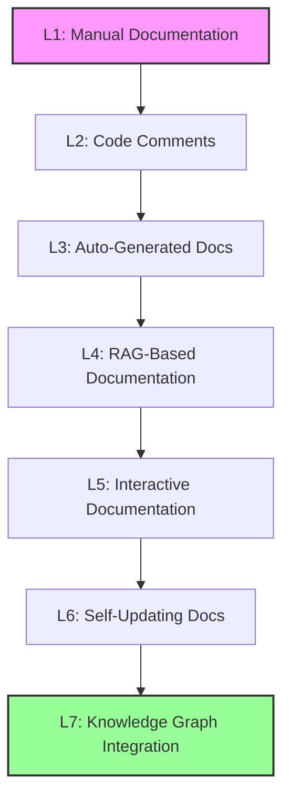
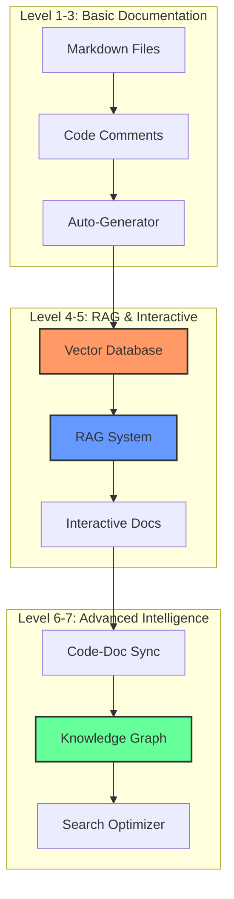

# Documentation & Knowledge Management Meta-Framework

## Executive Summary

A comprehensive categorical meta-framework for evolving documentation systems from manual markdown to intelligent knowledge graphs with full RAG integration, auto-generation capabilities, and self-updating mechanisms.

## Framework Overview

### Domain Priority
- **Domain**: Documentation & Knowledge Management
- **Priority**: #9
- **Category Theory Approach**: Comprehensive (functors, monoidal, coalgebras)

### 7-Level Evolution Model



## Level Definitions

### Level 1: Manual Documentation
**Category**: Objects in **Doc**
- Markdown files with basic structure
- README files and guides
- Manual maintenance and updates
- Version control tracked

### Level 2: Code Comments
**Category**: Morphisms in **Doc → Code**
- Docstrings and inline comments
- Type hints and annotations
- JSDoc/PyDoc conventions
- API documentation seeds

### Level 3: Auto-Generated Docs
**Category**: Functors **Code → Doc**
- Sphinx for Python projects
- JSDoc for JavaScript
- Rustdoc for Rust
- Automated API reference generation

### Level 4: RAG-Based Documentation
**Category**: Monoidal functors **Doc ⊗ Query → Response**
- Vector database integration
- Semantic search capabilities
- Context-aware responses
- Multi-source aggregation

### Level 5: Interactive Documentation
**Category**: Coalgebras **State → Doc × State**
- Executable examples
- Jupyter notebooks
- Interactive playgrounds
- Live code demonstrations

### Level 6: Self-Updating Docs
**Category**: Natural transformations **Code ⇒ Doc**
- Code change detection
- Automatic documentation updates
- Sync verification
- Consistency maintenance

### Level 7: Knowledge Graph Integration
**Category**: Kan extensions **Doc ⇒ Knowledge**
- Concept relationship mapping
- Automatic cross-linking
- Semantic navigation
- Ontology integration

## Categorical Framework

### 1. Functor-Based Transformations

```python
from typing import Protocol, TypeVar, Generic
from abc import ABC, abstractmethod

D = TypeVar('D')  # Documentation type
C = TypeVar('C')  # Code type
K = TypeVar('K')  # Knowledge type

class DocFunctor(Protocol[D, C]):
    """Functor from Code to Documentation"""

    def map(self, code: C) -> D:
        """Transform code into documentation"""
        ...

    def compose(self, other: 'DocFunctor') -> 'DocFunctor':
        """Functor composition for pipeline creation"""
        ...
```

### 2. Monoidal Structure for RAG

```python
class RAGMonoid(ABC):
    """Monoidal structure for RAG operations"""

    @abstractmethod
    def tensor(self, doc: D, query: str) -> tuple[D, float]:
        """Tensor product: doc ⊗ query → (response, relevance)"""
        pass

    @abstractmethod
    def unit(self) -> D:
        """Identity element for documentation"""
        pass

    @abstractmethod
    def associator(self, a: D, b: D, c: D) -> D:
        """Associativity constraint for doc composition"""
        pass
```

### 3. Coalgebra for Interactive Docs

```python
class InteractiveDocCoalgebra(Generic[D]):
    """Coalgebra for interactive documentation state"""

    def __init__(self, initial_state: D):
        self.state = initial_state

    def unfold(self) -> tuple[D, 'InteractiveDocCoalgebra[D]']:
        """Coalgebraic unfold: State → Doc × State"""
        return self.render(), self.next_state()

    @abstractmethod
    def render(self) -> D:
        """Render current documentation state"""
        pass

    @abstractmethod
    def next_state(self) -> 'InteractiveDocCoalgebra[D]':
        """Compute next state based on interactions"""
        pass
```

## Luxor Marketplace Integration

### Commands
```yaml
commands:
  docrag:
    description: "RAG-based documentation query"
    category: "level-4"

  summarize:
    description: "Generate documentation summaries"
    category: "level-3"

  research:
    description: "Deep documentation research"
    category: "level-7"
```

### Agents
```yaml
agents:
  doc-rag-builder:
    level: 4
    capabilities:
      - Vector database setup
      - Embedding generation
      - Query processing

  docs-generator:
    level: 3
    capabilities:
      - Auto-documentation
      - API reference generation
      - Code parsing

  context7-doc-reviewer:
    level: 6
    capabilities:
      - Documentation validation
      - Consistency checking
      - Update detection

  deep-researcher:
    level: 7
    capabilities:
      - Knowledge extraction
      - Concept mapping
      - Relationship discovery
```

### Workflows
```yaml
workflows:
  research-to-documentation:
    stages:
      - research: "Gather information"
      - synthesis: "Combine sources"
      - generation: "Create documentation"
      - validation: "Verify accuracy"
      - publishing: "Deploy docs"
```

### Skills
```yaml
skills:
  documentation-patterns:
    - api-reference-generation
    - tutorial-creation
    - concept-explanation
    - example-crafting
    - diagram-generation
```

## Core Components

### 1. Documentation Structure

```python
class DocumentationStructure:
    """Core documentation organization"""

    def __init__(self):
        self.hierarchy = {
            'guides': [],
            'tutorials': [],
            'api_reference': [],
            'examples': [],
            'concepts': []
        }

    def add_document(self, category: str, doc: dict):
        """Add document to structure"""
        if category in self.hierarchy:
            self.hierarchy[category].append(doc)

    def generate_index(self) -> str:
        """Generate documentation index"""
        index = "# Documentation Index\n\n"
        for category, docs in self.hierarchy.items():
            index += f"## {category.replace('_', ' ').title()}\n"
            for doc in docs:
                index += f"- [{doc['title']}]({doc['path']})\n"
        return index
```

### 2. RAG System Design

```python
import numpy as np
from typing import List, Tuple

class RAGSystem:
    """Retrieval-Augmented Generation for documentation"""

    def __init__(self, vector_dim: int = 768):
        self.vector_dim = vector_dim
        self.document_store = []
        self.embeddings = []

    def add_document(self, doc: str, metadata: dict):
        """Add document to RAG system"""
        embedding = self.generate_embedding(doc)
        self.document_store.append({
            'content': doc,
            'metadata': metadata,
            'embedding': embedding
        })
        self.embeddings.append(embedding)

    def generate_embedding(self, text: str) -> np.ndarray:
        """Generate text embedding"""
        # Simplified - would use actual embedding model
        return np.random.randn(self.vector_dim)

    def search(self, query: str, k: int = 5) -> List[Tuple[dict, float]]:
        """Semantic search for relevant documents"""
        query_embedding = self.generate_embedding(query)

        # Compute similarities
        similarities = []
        for i, doc_embedding in enumerate(self.embeddings):
            similarity = np.dot(query_embedding, doc_embedding)
            similarities.append((self.document_store[i], similarity))

        # Return top-k results
        similarities.sort(key=lambda x: x[1], reverse=True)
        return similarities[:k]

    def generate_response(self, query: str, context_docs: List[dict]) -> str:
        """Generate response using retrieved context"""
        context = "\n".join([doc['content'] for doc in context_docs])

        # Simplified - would use LLM for generation
        return f"Based on the documentation:\n{context[:500]}..."
```

### 3. Vector Database Integration

```python
from dataclasses import dataclass
from typing import Optional
import json

@dataclass
class VectorDocument:
    """Document with vector representation"""
    id: str
    content: str
    embedding: np.ndarray
    metadata: dict

class VectorDatabase:
    """Vector database for documentation"""

    def __init__(self, dimension: int = 768):
        self.dimension = dimension
        self.documents = {}
        self.index = None  # Would be FAISS/Pinecone/etc

    def upsert(self, doc: VectorDocument):
        """Insert or update document"""
        self.documents[doc.id] = doc
        # Update vector index
        self._update_index()

    def search(self, query_vector: np.ndarray, k: int = 10) -> List[VectorDocument]:
        """Vector similarity search"""
        # Simplified - would use actual vector search
        results = []
        for doc in self.documents.values():
            similarity = np.dot(query_vector, doc.embedding)
            results.append((doc, similarity))

        results.sort(key=lambda x: x[1], reverse=True)
        return [doc for doc, _ in results[:k]]

    def _update_index(self):
        """Update vector search index"""
        # Would rebuild FAISS/Pinecone index
        pass
```

### 4. Auto-Documentation Generator

```python
import ast
import inspect
from typing import Any

class AutoDocGenerator:
    """Automatic documentation generation from code"""

    def __init__(self):
        self.processors = {
            'python': self.process_python,
            'javascript': self.process_javascript,
            'typescript': self.process_typescript
        }

    def generate(self, source_path: str, language: str) -> str:
        """Generate documentation from source code"""
        if language in self.processors:
            return self.processors[language](source_path)
        raise ValueError(f"Unsupported language: {language}")

    def process_python(self, source_path: str) -> str:
        """Process Python source for documentation"""
        with open(source_path, 'r') as f:
            source = f.read()

        tree = ast.parse(source)
        doc = "# API Documentation\n\n"

        for node in ast.walk(tree):
            if isinstance(node, ast.ClassDef):
                doc += self._document_class(node)
            elif isinstance(node, ast.FunctionDef):
                doc += self._document_function(node)

        return doc

    def _document_class(self, node: ast.ClassDef) -> str:
        """Document a class"""
        doc = f"\n## Class: {node.name}\n\n"
        if ast.get_docstring(node):
            doc += f"{ast.get_docstring(node)}\n\n"

        # Document methods
        for item in node.body:
            if isinstance(item, ast.FunctionDef):
                doc += self._document_method(item)

        return doc

    def _document_function(self, node: ast.FunctionDef) -> str:
        """Document a function"""
        doc = f"\n### Function: {node.name}\n\n"
        if ast.get_docstring(node):
            doc += f"{ast.get_docstring(node)}\n\n"

        # Document parameters
        doc += "**Parameters:**\n"
        for arg in node.args.args:
            doc += f"- `{arg.arg}`\n"

        return doc

    def _document_method(self, node: ast.FunctionDef) -> str:
        """Document a class method"""
        doc = f"\n### Method: {node.name}\n\n"
        if ast.get_docstring(node):
            doc += f"{ast.get_docstring(node)}\n\n"
        return doc

    def process_javascript(self, source_path: str) -> str:
        """Process JavaScript source for documentation"""
        # Would use acorn/babel parser
        return "// JavaScript documentation"

    def process_typescript(self, source_path: str) -> str:
        """Process TypeScript source for documentation"""
        # Would use TypeScript compiler API
        return "// TypeScript documentation"
```

### 5. Code-Doc Synchronization

```python
import hashlib
from datetime import datetime
from pathlib import Path

class CodeDocSync:
    """Synchronization between code and documentation"""

    def __init__(self, code_dir: Path, doc_dir: Path):
        self.code_dir = code_dir
        self.doc_dir = doc_dir
        self.sync_map = {}  # code_file -> doc_file mapping
        self.checksums = {}  # file -> checksum mapping

    def scan_changes(self) -> List[str]:
        """Scan for code changes requiring doc updates"""
        changed_files = []

        for code_file in self.code_dir.rglob('*.py'):
            current_checksum = self._compute_checksum(code_file)

            if code_file in self.checksums:
                if self.checksums[code_file] != current_checksum:
                    changed_files.append(str(code_file))
            else:
                changed_files.append(str(code_file))

            self.checksums[code_file] = current_checksum

        return changed_files

    def sync_documentation(self, changed_files: List[str]):
        """Update documentation for changed code files"""
        for code_file in changed_files:
            doc_file = self._get_doc_path(code_file)
            self._update_documentation(code_file, doc_file)

    def _compute_checksum(self, file_path: Path) -> str:
        """Compute file checksum"""
        with open(file_path, 'rb') as f:
            return hashlib.md5(f.read()).hexdigest()

    def _get_doc_path(self, code_file: str) -> Path:
        """Get corresponding documentation path"""
        code_path = Path(code_file)
        relative_path = code_path.relative_to(self.code_dir)
        doc_path = self.doc_dir / relative_path.with_suffix('.md')
        return doc_path

    def _update_documentation(self, code_file: str, doc_file: Path):
        """Update documentation for a code file"""
        # Generate new documentation
        generator = AutoDocGenerator()
        new_doc = generator.generate(code_file, 'python')

        # Add sync metadata
        metadata = f"\n\n---\n*Last synced: {datetime.now().isoformat()}*\n"
        metadata += f"*Source: {code_file}*\n"

        # Write updated documentation
        doc_file.parent.mkdir(parents=True, exist_ok=True)
        with open(doc_file, 'w') as f:
            f.write(new_doc + metadata)
```

### 6. Search Optimization

```python
from typing import Dict, Set
import re

class SearchOptimizer:
    """Optimize documentation search"""

    def __init__(self):
        self.index = {}  # term -> document IDs
        self.documents = {}  # ID -> document
        self.idf_scores = {}  # term -> IDF score

    def build_index(self, documents: List[Dict[str, str]]):
        """Build inverted index for search"""
        doc_count = len(documents)
        term_doc_counts = {}

        for doc_id, doc in enumerate(documents):
            self.documents[doc_id] = doc
            terms = self._tokenize(doc['content'])

            unique_terms = set(terms)
            for term in unique_terms:
                if term not in self.index:
                    self.index[term] = set()
                self.index[term].add(doc_id)

                if term not in term_doc_counts:
                    term_doc_counts[term] = 0
                term_doc_counts[term] += 1

        # Calculate IDF scores
        for term, count in term_doc_counts.items():
            self.idf_scores[term] = np.log(doc_count / count)

    def search(self, query: str, max_results: int = 10) -> List[Dict]:
        """Optimized search with TF-IDF ranking"""
        query_terms = self._tokenize(query)
        doc_scores = {}

        # Find matching documents
        matching_docs = set()
        for term in query_terms:
            if term in self.index:
                matching_docs.update(self.index[term])

        # Score documents
        for doc_id in matching_docs:
            score = self._calculate_score(query_terms, doc_id)
            doc_scores[doc_id] = score

        # Sort and return top results
        sorted_docs = sorted(doc_scores.items(), key=lambda x: x[1], reverse=True)
        results = []
        for doc_id, score in sorted_docs[:max_results]:
            result = self.documents[doc_id].copy()
            result['score'] = score
            results.append(result)

        return results

    def _tokenize(self, text: str) -> List[str]:
        """Tokenize text for indexing"""
        # Simple tokenization - would use NLP library in production
        text = text.lower()
        tokens = re.findall(r'\w+', text)
        return tokens

    def _calculate_score(self, query_terms: List[str], doc_id: int) -> float:
        """Calculate TF-IDF score for document"""
        doc = self.documents[doc_id]
        doc_terms = self._tokenize(doc['content'])

        score = 0.0
        for term in query_terms:
            tf = doc_terms.count(term) / len(doc_terms)
            idf = self.idf_scores.get(term, 0)
            score += tf * idf

        return score
```

### 7. Knowledge Extraction

```python
from typing import List, Tuple
import networkx as nx

class KnowledgeExtractor:
    """Extract knowledge graph from documentation"""

    def __init__(self):
        self.graph = nx.DiGraph()
        self.concept_patterns = [
            r'(\w+) is a (\w+)',
            r'(\w+) extends (\w+)',
            r'(\w+) implements (\w+)',
            r'(\w+) uses (\w+)'
        ]

    def extract(self, documents: List[str]) -> nx.DiGraph:
        """Extract knowledge graph from documents"""
        for doc in documents:
            concepts = self._extract_concepts(doc)
            relationships = self._extract_relationships(doc)

            # Add to graph
            for concept in concepts:
                self.graph.add_node(concept['name'], **concept)

            for rel in relationships:
                self.graph.add_edge(
                    rel['source'],
                    rel['target'],
                    relation=rel['type']
                )

        return self.graph

    def _extract_concepts(self, text: str) -> List[Dict]:
        """Extract concepts from text"""
        concepts = []

        # Simple extraction - would use NER in production
        sentences = text.split('.')
        for sentence in sentences:
            # Look for definitions
            if ' is ' in sentence:
                parts = sentence.split(' is ')
                if len(parts) == 2:
                    concepts.append({
                        'name': parts[0].strip(),
                        'definition': parts[1].strip()
                    })

        return concepts

    def _extract_relationships(self, text: str) -> List[Dict]:
        """Extract relationships between concepts"""
        relationships = []

        for pattern in self.concept_patterns:
            matches = re.findall(pattern, text, re.IGNORECASE)
            for match in matches:
                relationships.append({
                    'source': match[0],
                    'target': match[1],
                    'type': self._infer_relation_type(pattern)
                })

        return relationships

    def _infer_relation_type(self, pattern: str) -> str:
        """Infer relationship type from pattern"""
        if 'is a' in pattern:
            return 'is_a'
        elif 'extends' in pattern:
            return 'extends'
        elif 'implements' in pattern:
            return 'implements'
        elif 'uses' in pattern:
            return 'uses'
        return 'related_to'

    def find_paths(self, source: str, target: str) -> List[List[str]]:
        """Find all paths between concepts"""
        try:
            paths = list(nx.all_simple_paths(self.graph, source, target))
            return paths
        except nx.NetworkXNoPath:
            return []

    def get_related_concepts(self, concept: str, depth: int = 2) -> Set[str]:
        """Get related concepts within given depth"""
        if concept not in self.graph:
            return set()

        related = set()
        current_level = {concept}

        for _ in range(depth):
            next_level = set()
            for node in current_level:
                neighbors = set(self.graph.successors(node))
                neighbors.update(self.graph.predecessors(node))
                next_level.update(neighbors)

            related.update(next_level)
            current_level = next_level

        return related - {concept}
```

## Implementation Architecture



## Performance Metrics

### Documentation Quality Metrics
- **Coverage**: Percentage of code with documentation
- **Freshness**: Time since last update
- **Completeness**: Required sections present
- **Accuracy**: Sync with code reality

### Search Performance Metrics
- **Precision**: Relevant results / Total results
- **Recall**: Found relevant / All relevant
- **F1 Score**: Harmonic mean of precision and recall
- **Response Time**: Query latency

### RAG System Metrics
- **Retrieval Quality**: MRR, NDCG scores
- **Generation Quality**: BLEU, ROUGE scores
- **Context Relevance**: Semantic similarity
- **User Satisfaction**: Feedback scores

## Next Steps

1. **Kan Extension Iteration 1**: Enhanced category theory implementation
2. **Kan Extension Iteration 2**: Advanced RAG optimizations
3. **Kan Extension Iteration 3**: Knowledge graph improvements
4. **Kan Extension Iteration 4**: Full automation capabilities

This framework provides a complete foundation for evolving documentation systems through categorical abstractions and practical implementations.